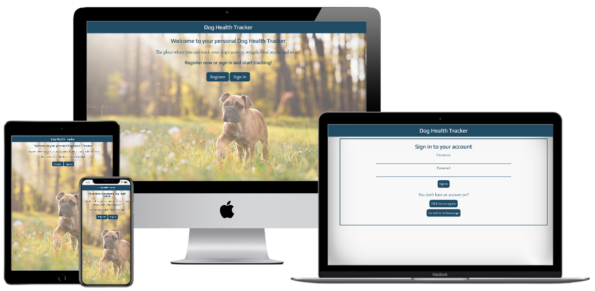

# **Dog Health Tracker**




## **Goal for this project**

Have you ever gone to the veterinarian with your dog and they ask all kind of questions that you don't really know the answer to...
How much activity does your dog have? Have much does he/she eats? Is her weight stable? 
And on top of this, they tell you that your dog should actually lose some weight... Where to start?

The Dog Health Tracker will make you're life much easier! 
Instead writing down all the information about the activity, food, weigth etc. on paper, you can use DHT to track! 
By adding a daily log on the topics previously mentioned, you can easily track the progress of your dog. 

Next time you go to the veterinarian, you choose nicely the progress you and your dog have made! 
And you will finally be able to answer all those questions they are asking! 

Thank you for visiting my project!  
If you have any feedback or questions, head over to my GitHub contact details and feel free to reach out to me.

--- 

<a></a>

## Table of contents 
* [UX](#ux)
    * [User Goals](#user-goals)
    * [User Stories](#user-stories)
    * [Site Owners Goals](#site-owners-goals)
    * [User Requirements and Expectations](#user-requirements-and-expectations)
        * [Requirements](#requirements)
        * [Expectations](#expectations)
    * [Design Choices](#design-choices)
        * [Fonts](#fonts)
        * [Colors](#colors)
        * [Structure](#structure)
* [Wireframes and Flowcharts](#wireframes-and-flowcharts)
    * [Wireframes](#wireframes)
    * [Flowcharts](#flowcharts)
    * [Database Structure](#database-structure)
* [Features](#features)
    * [Existing Features](#existing-features)
    * [Features to be implemented](#features-to-be-implemented)
* [Technologies used](#technologies-used)
    * [Languages](#languages)
    * [Libraries and Frameworks](#libraries-and-frameworks)
    * [Tools](#tools)
* [Testing](#testing)
* [Deployment](#deployment)
    * [Local Deployment](#local-deployment)
    * [Heroku Deployment](#heroku-deployment)
* [Credits](#credits)

--- 

<a name="ux"></a>

## **UX**

<a></a>

### **User Goals**

* The website has to work well on all kind of devices like mobile phones, tables and desktops.
* I want to have a clear dashboard where I can see all the different logs I have created. 
* The log should appear with the most recent one on top to be relevant. 
* I want to have a profile for my dog where I can enter information like the name, breed etc. 
* I would like to have the option to add multiple dogs
* The website has to be easy to use and easy to update information
* Visually appealing website

[Back to Top](#table-of-contents)

<a></a>

### **User Stories**

* As a user, I would like to be able to register for the website so I can have my personal environment.
* As a user, I want to login after I created an account and see my previous inserted information.
* As a user, I would like to have a personal profile for my dog. 
* As a user, I would like to track activity, food and weigth. 
* As a user, I want to be able to add as many logs as I want, even multiple per day (morning and evening for example)
* As a user, I would like to have a dashboard where I can have a good overview. 
* As a user, I want to be able to search on date to get specific data. 
* As a user, I want to be able to add special notes to the log whenever relevant. 
* As a user, I want to be able to add another dog.
* As a user, I want to be able to edit the dog profile.
* As a user, I want to have the possibility to edit a log when I made a mistake or want to add/delete some info. 
* As a user, I want to have the possibiltiy to delete a log as well when no longer relevant. 
* As a user, I want the website to be easy to use. 
* As a user, I want the process to add / edit / delete info to be easy

<a></a>

### **Site owners Goals**
* To have an appealing website that dog owners use to track their dog's weight, activity, food, etc.
* To have a great functionality so the user feels like this website helps them in their day-to-day life. 
* To make the website as personal as possible by giving the user the possibility to add information about their dog in the profile.


[Back to Top](#table-of-contents)

<a></a>

### **User Requirements and Expectations**

<a></a>

#### Requirements

* Easy to navigate by using the few buttons
* Appealing dashboard with a functional overview
* Easy way to add a log to the dashboard
* Easy way to add another dog to the profile
* Ability to edit and delete existing logs

<a></a>

#### Expectations

* When you have multiple dogs, it should be easy to navigate between them
* To have a dashboard where all the necessary information is visible
* It should be easy to add another log 
* Personalised profile with information about the dog and an image
* To be able to filter on the logs in order to get specific information

[Back to Top](#table-of-contents)

<a></a>

### **Design Choices**

I have used [Coolors](https://coolors.co/ "Coolors.co") to come up with a color scheme that matches the atmosphere of a Health Tracker.
For this website I have deciced to keep design simple, meaning I opted for a white background color with some light gray for the profile and logs.
I have added some color (blue) for the buttons, navigation bar and footer to make the design more visually appealing to the user. 
The reason for this is that for this project, the functionality is much more important and as there are a lot of functionalities I don't want to distract the user with overwhelming colors. 

<a></a>

#### Colors

Like I mentioned before, I have decided to use some colors that fit well with the feeling of a Health Tracker.
Below I will explain more why I choose the various colors and for what I will be using them.


* #ffffff: I have decided to keep the background of the overall website white in order give the clean look. I will also use this color as text color for the nav bar and buttons.
* #D9D9D9: This color I will use as a background color for whole dashboard. 
* #F5F5F5: This color I will use as a background color for the logs on the dashboard in order to have a small contract versus #D9D9D9 dashboard color.
* #284B63: This will be the color that I will use for my navigation bar and buttons in order to give a bit of color to the website. This color will also be used as the overall text color.

I have used a contrast checker in order to make sure that the contrast is sufficient.
This way my content will be easily readable. 

<a></a>

#### Fonts
In order to find appropriate fonts for my website, I have visited [Google Fonts](https://fonts.google.com/ "Google Fonts") to explore the various options.
For the titles and subtitles, I have used the font [Play](https://fonts.google.com/specimen/Play "Play") 
and for the main text I have used [Cormorant Garamond](https://fonts.google.com/specimen/Cormorant+Garamond "Cormorant Garamond"). 

<a></a>

#### Structure

I have chosen to use [Materialize](https://materializecss.com/) to create an overall structure for my website. 
Materialize provides various elements of CSS and Javascript which is very helpful to keep a good structure on your page. 
The reason why I choose Materiaize is mainly due to the various features they offer like a datepicker, floating action button etc. 

[Back to Top](#table-of-contents)

--- 
<a></a>

## **Wireframes and Flowcharts**

### **Wireframes**
I used [Balsamic](https://balsamiq.com/wireframes/) to create wireframes for my website. 

You can find my wireframes below:

For the homepage I have only created 1 wireframe as the design is quite basic and looks identical on all screen sizes.
* [Home](wireframes/desktop-home.png)

#### Desktop Wireframes
* [Dashboard](wireframes/desktop-dashboard.png)
* [Add Dog](wireframes/desktop-adddog.png)
* [Add Log](wireframes/desktop-addlog.png)

#### Tablet Wireframes
* [Dashboard](wireframes/tablet-dashboard.png)
* [Add Dog](wireframes/tablet-adddog.png)
* [Add Log](wireframes/tablet-addlog.png)

#### Mobile Wireframes
* [Dashboard](wireframes/mobile-dashboard.png)
* [Add Dog](wireframes/mobile-adddog.png)
* [Add Log](wireframes/mobile-addlog.png)

### **Flowcharts**

I have decided to make a flowchart for the sign-in / register proccess to completely understand each step of the process.  
I have used [Draw.io](https://draw.io/) to make this flowchart which you can view below: 

[Flowchart](wireframes/flowchart.png)

### **Database Structure**

I have used MongoDB to set up the database for this project with the following collections: 

#### **Users:**

Key      | Value
---------|-----------
_id      | ObjectId
username | String
password | String

#### **Dogs:**

Key             | Value
----------------|-----------
_id             | ObjectId
user_id         | String
dog_name        | String
dog_breed       | String
date_of_birth   | String
dog_description | String
dog_image       | String

#### **Logs:**

Key             | Value
----------------|-----------
_id             | ObjectId
dog_id          | String
user_id         | String
log_date        | String
dog_weigth      | String
weigth_metric   | String
dog_activity    | String
dog_food        | String
food_metric     | String
other_notes     | String

#### **Food_metrics** ####

Key             | Value
----------------|-----------
_id             | ObjectId
metric_name     | String

#### **Weigth_metrics** ####

Key             | Value
----------------|-----------
_id             | ObjectId
metric_name     | String


[Back to Top](#table-of-contents)

---

<a></a>

## **Features**

<a></a>

### **Existing Features**

* Registration functionality
* Sign-In and Out functionality
* Add multiple dogs per user 
* CRUD Functions:
    * Create: possibility to add various dogs and logs
    * Read: dashboard where you can view the dog profile(which was selected) and its logs
    * Update: possibility to update the dog profile and logs
    * Delete: possibility to delete the dog profiles and logs
* Search logs by log date

<a></a>

### **Features to be implemented**

* Currently the user can only insert image url. In the future I would like that the user can upload an image from its computer and/or cloud accounts.
* Have a more extensive user profile with, profile image, preferences and email to which you can send updates, newsletters etc.
* Have a 'forget password' functionality.
* Include a confirm password to make sure the user has chosen the password he/she wanted. 
* Possibility for the user to be able to add (and remove) categories they would like to specificely track for their dog like medication etc. 
* The possibility to filter the logs based on range of data or by month.
* Expand search function so user can filter on more keywords except for log_date.
* Submit search form as soon as the user selected a date to prevent confusion for the user. (Did I already click search or not)
* Add pagination so the list of logs will be display with a max of 20 logs per page.
* When the user has added their first log, I would like to remember the chosen metrics for any futher logs so they don't have to update this every time they add a log.
    This would be done through profile preferences or store the data in a cookie. 
* Give the user the possibility to add a 'Picture of the day' to the log and display it on the dashboard.
* Add a graph overview page, especially for the tracking of the weight with nice visual aspect.

[Back to Top](#table-of-contents)

<a></a>

## **Technologies used**

<a></a>

### **Languages**

* [HTML](https://en.wikipedia.org/wiki/HTML)
* [CSS](https://en.wikipedia.org/wiki/Cascading_Style_Sheets)
* [JavaScript](https://en.wikipedia.org/wiki/JavaScript)
* [Python](https://www.python.org/)

<a></a>

### **Libraries and Frameworks**

* [Font Awesome](https://fontawesome.com/)
* [Materialize](https://materializecss.com/)
* [Google Fonts](https://fonts.google.com/)
* [jQuery](https://jquery.com/)

### **Tools**
* [Git](https://git-scm.com/)
* [GitPod](https://www.gitpod.io/)
* [Heroku](https://www.heroku.com/)
* [Balsamic](https://balsamiq.com/wireframes/)
* [W3C HTML Validation Service](https://validator.w3.org/)
* [W3C CSS Validation Service](https://jigsaw.w3.org/css-validator/)
* [techsini](http://techsini.com/)
* [MongoDB Atlas](https://www.mongodb.com/)
* [Flask](https://flask.palletsprojects.com/en/1.1.x/)
* [PyMongo](https://api.mongodb.com/python/current/tutorial.html)
* [Jinja](https://jinja.palletsprojects.com/en/2.11.x/)

[Back to Top](#table-of-contents)

<a></a>


## **Testing**

### **Registration**

#### User story: As a user, I would like to be able to register for the website so I can have my personal environment

* **Plan**  
I want to create a page where the user can register for its personal account to which only the user has access.
My first plan was to redirect the user to the add_dog form right away to add the first dog but I realised it might confuse the user. 
Therefore after registration, the user will be taken to a "blank dashboard" where the only call-to-action will be to add their first dog.
This way the user can make 'the decision' to add a dog profile themselves and I don't make that choice for them.

* **Implementation**  
I created a form where the user can choose a username and a password. 
I have used the pattern attribute to only allow certain characters for the username and password. 
Correct feedback will be displayed whenever the user doesn't meet the pattern critera. 
Before creating the new account, I will check in the database if the username already exists. 
If so, correct feedback will be displayed to the user so he can choose another username. 
Password will be stored with the help of the password generate hash so it is stored safely.
After the registration was succesfull, the user will be redirected to the blank dashboard to add their first dog.
In case the user wrongfully clicked on register instead of sign-in, a link to the sign-in page is provided so the user doesn't have to go back. 
I have also implemented a 'Go back to the homepage' link so the user doesn't have to use the back button of the browser in case he/she wants to go back to the homepage.

I have used a variable (register) to make the difference between the register and sign-in form.
When register is equal to True, I added the span which explains the requested format.
By implementing this, I have managed to merge the register and sign-in form into 1 form which simplifies my code. 


* **Test**  
I have tried to create an account with an already existing username. Correct feedback is displayed.
Whenever I didn't meet the pattern criteria, the correct feedback was displayed, explaining which charachters etc are allowed. 
User acccount is created whenever all criteria was met and user is being redirect to blank dashboard.

I noticed that the feedback provided to the user when their input didn't match the required format was not being displayed on all devices. 
After some research I have decided to add the required pattern right above the input fields so the user will always know which format to use.

After receiving some feedback from friends and family who have tested the website, I have decided to make the feedback message stand out more. 
It took the user a while to notice the feedback when the username already exists. I have changed the text color to red so it really stands out. 

* **Result**  
Registration form is working as planned and user information is stored safely in the mongodb Users collection.
Feedback provided stands out nicely to inform the user. 
Redirection to blank dashboard works as well as planned so the user can choose to add its dog right away. 
'Back to homepage' link works as well and takes the user back to the homepage
Tested the registration on various browers and devices and the form is responsive and userfriendly. 
Having the pattern as a fixed element on the page, improved the user experience. 
Instead of filling in the fields without knowing the pattern, receiving the feedback and then filling in the fields again, the user can now insert right away the fields with the correct pattern. 

* **Verdict**
The test has passed all the criteria and works like planned.

### **Sign In**

#### User story: As a user, I want to login after I created an account and see my previous inserted information.

* **Plan**  
My plan is to create a login form where the user can fill in its username and password.
After signing in, the user will be redirected to the dashboard where the user can see the previously inserted information.
In case the user doesn't have any dog added to its profile, the user will be redirected to the blank dashboard where a dog profile can be added.

* **Implementation**  
I created a form where the user can fill in its username and password which will be verified with the information stored in the database. 
When the wrong information is being filled in, the correct feedback will be provided to the user. 
In case the user wrongfully clicked on sign-in instead of register, a link to the register page is provided so the user doesn't have to go back. 
I have also implemented a 'Go back to the homepage' link so the user doesn't have to use the back button of the browser in case he/she wants to go back to the homepage.

* **Test**  
Signing in with the correct username and password works as planned and the correct dashboard of that user will be displayed. 
When the user fills in the wrong username and/or password, the correct message is being displayed on the screen. 
Also here the feedback message didn't stand out well enough so I have changed the color to red. 
Redirecting to register page and 'back to homepage' link works as well. 

* **Result**  
Sign-in form is working as planned and the input is being verified correctly with the stored information of the database.
Redirection to the correct dashboard works as well as planned so the user can either add a dog on the blank dashboard or view its previously inserted information.
Tested the sign-in form on various browers and devices and the form is responsive and userfriendly. 
Feedback provided to the user stands out nicely. 

* **Verdict**    
The test has passed all the criteria and works like planned.

### **Profile Dog**

#### User story: As a user, I would like to have a personal profile for my dog. 

* **Plan**  
The user should be able to created a profile for the dog in which it can fill in various information. 
Possible input fields should be the name of the dog, breed, date of birth, description and an image of the dog. 
A summary of the dog profile will be displayed on the dashboard overview. 

* **Implementation**  
I have created a form with the various input fields where the user can fill in the information. 
I have only made the dog_name field required as for the other fields, the user might not want to fill in this information. Some user might not know the date of birth etc so he/she might not want to fill this in. 
For the image, I worked with an url that has to be filled in. I don't have the required knowledge and skills yet to enable the user to upload an image from its device and/or cloud.
This will be implemented at a later stage when I have the required knowledge and skills. See [Features to be implemented](#features-to-be-implemented)
For the date of birth, I have implemented the datepicker from materialize so the user can select the date on the calendar. 
The range for years, goes until 30 years back (Research told me that the oldest dog in the world was 29 years old). 
The user can not pick a date in the future as that information is unknown. 
Manual input has been disabled so the user has to pick the date from the calendar and a correct date will be stored in the correct format. 
I have also added a cancel button that allows the user to go back to the dashboard in case the user doesn't want to proceed. 

* **Test**  
I have tested the add dog form various times to make sure it works properly.
The input is stored correctly in the dogs collection in the database. 
Calendar works as planned with the correct year range being displayed and when clicking a day on the calendar, the calendar automatically closes. 
Cancel button works as planned and takes the user back to the dashboard after resolving some issues. See [Bugs](#bugs)
In order to display the correct dogs for the user, I have addded the _id of the user as a hidden inputfield for the add dog which is stored in the database.

When testing this on mobile devices (iPhoneSE and iPhone8), I noticed that the datepicker was not working how it should.
After conducting various reseach, I have come up with solution which you can find under [Bugs](#bugs).

After various testing, I came to the conclusion that it didn't make sense that the user was able to add dog profiles with the same name.
When the user adds a dog, I now first check if the user already has a dog profile with that name and the correct feedback is being shown to the user. 
Implementing this, brought another issue along with the cancel add button in case the user has more than 1 dog already added to its profile. 
When the user now wants to create another profile with the same name, receives feedback that the profile already exists and then clicks 'cancel', 
the user will be taken to the profile for which he/she wanted to create a profile. 

* **Result**  
Adding a profile for the dog works as planned and looks good across various browsers and devices. 
This includes the inputfields, the datepicker (with the correct range of years), cancel button. 
Upon submitting the form, the input is stored correctly in the database. 

* **Verdict**  
The test has passed all the criteria and works like planned.

### **Add log**

#### User story: As a user, I would like to track activity, food and weigth. 

* **Plan**  
The user should be able to add logs with the various information that needs to be tracked.   
From own experience, I have decided to include the following input fields:  
*Date of the log*  
*Activity*   
*Weigth*  
*Food*   
*Other notes*   

* **Implementation**  
Also here I have created a form with the various inputfields. 
For date I have again used the datepicker with future dates disabled as you shouldn't be able to log for future data. 
The log_date field is the only field that is required to be filled in by the user as it's important for tracking purpose. 
The other fields are not required as some users might not want to track certain fields. 
I have made the decision to allow multiple logs per day as some users would like to create a log in the morning and one in the evening for example. 
This can depend on the user wanting to add a log twice per day as he/she feeds the dog twice per day etc. 
For the activity I have not added any metrics etc because it can vary a lot depending on the user and the dog (example: playing with a stick can also be seen as activity for some users)
For the weigth I have inlucded metrics (kg, grams, pounds and ounces) which are the most important weight metrics being used. 
For the food I have included the same metrics. 
For other notes the user can choose what to fill in like comments on the behaviour of the dog, medication, vet's appointment etc. 
Also here I added a cancel button in case the user wants to go back to the dashboard without submitting the log. 

* **Test**  
I have tested the form on various browsers and devices and it works as planned. 
The correct input is stored in the logs collection in the database. 
In order to be able to display the relevant logs of the dog, I have added 2 hidden fields on the form: user_id and dog_id. 
This information is also being stored in the database and through this, I'm able to display the logs of a specific dog from the user. 
Cancel button brings the user back to the dashboard as planned. 
Here we also encountered the same issue concerning the datepicker for which you can find the solution under [Bugs](#bugs).
My partner noticed that it was possible to fill in negative numbers on the form for weight and food. I have changed this to have a min value of 0.

* **Result**  
Log form for tracking purpose works as planned for various browsers and devices. 
Correct information is stored and relevant logs can be retrieved to display on dashboard. 

* **Verdict**  
The test has passed all the criteria and works like planned.


### **Dashboard**

#### User story: As a user, I would like to have a dashboard where I can have a good overview. 

* **Plan**  
I would like to create a dashboard where the user can see the profile of the dog on the left and the logs of the dog on the right. 
On small devices the profile will be displayed on top of the page with the logs of the dog below. 
Whenever the user has multiple dogs, I want that the user is able to select the profile that should be displayed on the dashboard. 
This will be displayed above the dog profile on small devices and on top of the dashboard for large screen. 
The dashboard should be very clear and intuitive to use.   

When the user doesn't have any dog yet added to its user account, a blank dashboard will be displayed with a very clear call-to-action to add the first dog. 
On the place where normally the logs would show, I will the following text: "After you added your dog, come here to start tracking!"

* **Implementation**  
My dashboard exists out of 2 main parts, the dog profile and the logs display. 

    *Dog profile*  
    Here it shows all the submitted information about the dog, including the image which gives a personal feeling to the user. 
    When the user hasn't filled in the url, it shows 'Click here to add an image' which takes the user to the edit dog profile page. 
    Left on top it has a add-dog-button where the user can click to add another dog. 
    Below the profile it shows an edit button and a delete button. 
    When the user doesn't have a dog added yet, it will display an empty profile with a call-to-action to add a dog profile.

    *Logs display*   
    The logs that will be displayed are from the dog profile selected. 
    When no dog profile is added yet, here it will show that as soon as they added a dog, they can come here to start tracking.
    When a dog profile is added but no logs are submitted yet, it shows 'Click here or on the add button right below to add your first log" which takes you to the logs page. 
    From the moment the user has at least submitted 1 log, another button will appear above the logs with the following text: Click here to search logs by date'. 
    This will take the user to the search logs page where a search can be performed by date. 
    For medium devices and up I have included a floating action button which is displayed right below on the screen. 
    Even if the user is in the middle of the screen, the button will be displayed, giving the user the possibility the add a log without having to scroll up to the top. 
    The floating action button will be hidden on small screens and a normal button will appear on below the search button. 
    I have implemented this because the floating action button was appearing on top of the dog profile which might have confused the user with the add another dog button. 

    Whenever the user has more than 1 dog in its profile, a select element will appear above the dashboard saying: "Select the dog profile you want to see". 
    Here the names of all the dogs that the user has will be displayed. 
    When the user clicks on the name, the form will be submitted (without submit button, by using javascript) and the profile and logs of that dog will be displayed on the dashboard. 

* **Test**  
The correct dashboard is being displayed depending on if the user has already added a dog profile.
When the dashboard is being displayed after registring and adding the first dog profle, the correct profile is being displayed under dog profile. 
Under logs the text to add first log is being displayed correctly.  
From the moment the user adds a first log, the log is being displayed nicely on the screen with nice focus on the date to make the dashboard more appealing. 
The text to add first log disappears and the button to search logs by date appears nicely above the log. 
When multiple logs have been added, the logs are ordered by log date with the most recent one first. 
The floating action button appears nicely on the right below corner of the screen with a bottom margin, so it doesn't disappear behind the footer. 
On small devices the floating action button disappears and a normal button appears right below the search button. 

    When the user has added more than 1 dog, the select box appears above the dashboard, allowing the user to select the profile that should be displayed on the dashboard. 

During testing I noticed that the order of logs was not correct. In app.py I sorted the logs by log_date with the most recent first. 
This was not going correctly as I had set a different format for the date, with the month written in full. 
The logs were being sorted incorrectly because of this. See [Bugs](#bugs) for the solution to this problem.

For some of my friends/family who have tested the website, it was not very clear what was the difference between the 2 + buttons. 
Therefore I have updated the add dog button to display a dog icon with a plus and the add log button, I changed to a playlist_add icon. 
This to improve the user experience and prevent confusion for the user. 

* **Result**  
The dashboard looks as planned across various browers and devices. 
All the functionalities work as planned and the correct information is being displayed on the screen. 
Hiding the floating action button on small devices works well and improves the user experience. 
After resolving the issue with the date format, the logs are being sorted correctly. 

* **Verdict**  
The test has passed all the criteria and works like planned.

### **Search Logs**

#### User story: As a user, I want to be able to search on date to get specific data. 

* **Plan**  
After a while the user will have a lot of logs which will make it more complicated to find a certain log. 
I want the user to be able to filter on the logs depending on the log date to make it easier find a certain log. 
In the future I would also like to add pagination to the logs so it doesn't look like an endless list of logs. See [Features to be implemented](#features-to-be-implemented)
Currently I don't have the required skills or knowledge for this so I will only implement the search function.
As the log_date is a required field for adding a log, the user will be able to search for all the logs. 

* **Implementation**  
As of the moment the user has added at least 1 log for the dog profile, a button will appear on top where the user can click to go to the search logs page. 
Upon loading the page, no logs will be displayed, only the search function for which I will use a datepicker. 
If the date that was inserted matches with the log date of one or multiple logs, those logs will be displayed on the screen. 
If there was no log found with that logs date, the following message will appear: 
"There are no logs for this date". 
After this, the user can either search on another date or return to the dashboard. 

The user also has the option to edit or delete a log after searching it by log_date. After they edited or deleted the log, the user will be taken back to the dashboard of the relevant dog. 

* **Test**  
When I implemented the above strategy, I noticed that the logs of other dogs where showing as well with the same log date. 
In my function I have included the dog_id in order to only display the logs of that date of the relevant dog. 
When no logs are found, the correct message is being displayed on the screen. 
The button to take the user back to the dashboard works as planned and the dashboard of the dog for which you were performing the search is being loaded. 

When you click a day, it is clear you still have to click search in order to see the results. But when you then select another date it migth be confusing to see if the form was already submitted or not. 
See [Features to be implemented](#features-to-be-implemented) for further explanation. 

* **Result**  
The search logs page works as planned across various browsers and devices. 
Search function works as planned and return the correct logs or feedback message depending on the user input. 
Button to take the user back to the relevant dashboard functions as planned. 

* **Verdict**  
The test has passed all the criteria and works like planned.

### **Multiple dog profiles**

#### User story: As a user, I want to be able to add another dog.

* **Plan**  
As some users might have multiple dogs, it is a good user experience that they can have all their dogs under 1 account instead having to create multiple user accounts. 
On the dashboard under dog profile, a button will be dislayed left on top where the user can click to add another dog. 
This will take the user to the add dog page, same page as where the user was redirected to after registering.
A cancel button will be displayed in case the user doesn't want to proceed with adding another dog.

* **Implementation**  
The form is the same one as when the user created a first dog profile.
The main difficulty of having multiple dogs per user, was the display on the dashboard. 
In the end I have decided to add a select box above the profile whenever the user has more than 1 dog added to the profile. 
In the select box I added a default option with the text: Select the dog profile you want to see. 
The option that the user can choose will depend on the amount of dogs added to the profile, the names of the dogs will be displayed as the value. 

    In order to accomplish the above, I have decidede to add the dog_id to the dashboard url. 
    Whenever the user clicks on the dog name in the select box, the form will automatically submit (with the help of javascript) and load the dog profile and logs of the selected dog. 
    Implementing the above solution meant as well that I had to rewrite a big part of my other functions. 
    This to make sure that everytime there was a redirect to the dashboard, the correct dog_id had to be included. 

    When the user signs in, the dashboard that will be displayed will be the first one that was loaded in the dogs collection of the database. 

* **Test**  
After I had implemented the above solution, I had to test all the other functionalities as well to make sure the correct dog profile was being displayed on the dashboard. 
Whenever the user has more than 1 dog, the select box is being displayed with the dog names that the user has created. 
Upon clicking the dog name for which the user would like to see the dashboard, the form is submitted and the correct info is being displayed. 
When the user removes the previously last dog (and has only 1 dog remaining), the select box disappears and profile of the remaining dog is displayed. 
I made sure that whenever a new log was added, edited or deleted, the dashboard of the relevant dog kept on being displayed on the screen. 

When testing on other devices (iPhone SE and iPhone8 in this case), we noticed that the select box was not working properly. 
This is was the same issue as I had for the datepicker. See solution under [Bugs](#bugs)

* **Result**  
Having multiple dogs on the profile was a big challenge which has taken a lot of time and testing. 
The functionality is now working as planned across various devices and browsers. 
The select box appears nicely like planned above the dashboard.

* **Verdict**  
The test has passed all the criteria and works like planned.

### **Edit log and dog profile**

#### User story: As a user, I want to be able to edit the dog profile / As a user, I want to have the possibility to edit a log when I made a mistake or want to add some info. 

* **Plan**  
The user has to be able to edit an existing log and dog profile when a mistake was made or when the user wants to add certain information. 
Here it is important that the information that the user inserted before remains intact and will be displayed on the page in order to have a good user experience. 
Every log and dog profile will have an edit button which will take the user to the editlog or editprofile screen. 

* **Implementation**  
For this functionality I used the same dog-form / log-form.  
I have used a variable (add) to make the difference between adding and editing a dog/log. 
When add is not equal to True, I added a value attribute with the previous filled in information. 
By implementing this, I have managed to merge the add and edit form into 1 form which simplifies my code. 
The value of the input fields will already be filled in with the information that the user has inserted before. 
When the user submits the form, all the fields will be updated in the relevant collection in the database. 
In order to make this function work, I had to include the dog_id for the edit dog profile and the log_id for the edit log profile. 
This way I made sure that the correct profile or log was updated. 

* **Test**  
I have tested the edit functionality various times to make sure the data was being updated correctly. 
After the submission of the form, the user is being redirected to the dashboard of the dog for which the changes were made. 
Cancel button also takes the user back to the dashboard in case the user doesn't want to proceed with the changes.

I noticed when testing that when the user would edit a dog profile and change the dog name to an already existing dog profile name, the user would still have 2 dog profiles with the same name. 
Also here I now first check to see if the dog name already exists in the database for this user and if so, feedback is provided to the user and the form is not being processed. 
The user can either choose a different name or cancel to go back to the dashboard. I still ran in quite some difficulties when implementing this. You can find more information in [Bugs](#bugs).

* **Result**  
The edit functionality works as planned across various browsers and devices. 
The correct document in the logs or dogs database in being updated and the user is taken back to the relevant dashboard. 
Cancel button redirects the user correctly to the relevant dashboard. 

* **Verdict**  
The test has passed all the criteria and works like planned.

### **Delete log and/or dog**

#### User story: As a user, I want to have the possibiltiy to delete a log as well when no longer relevant. 

* **Plan**  
    * Log  
    In case the information is no longer relevant, the user should be able to delete a log. 
    There will be a delete button (delete icon) which the user can use. The relevant log will be removed from the database and the user will stay on the relevant dashboard. 

    * Dog   
    The user should be able to delete the dog profile, even though there would only be 1 dog remaning. 
    If the last dog has been removed, the user will be taken again to the blank dashboard where the user can decide to add a dog. 
    The reason why I created a seperate dashboard for this is because the view dashboard url functions with the user id and the dog id, there always needs to be at least 1 dog added to the profile. 
    Therefore I created a blank dashboard which doesn't take the dog_id as a parameter with the same structure as the view_dashboard.
    When the user still has multiple dog and deletes a profile, the dashboard of the (one of the) remaining dog(s) will be displayed.

* **Implementation**  
I have added the delete button to every log, next to the edit button. 
I have worked with self explanatory icons which improves the overall look of the dashboard. 
When the user clicks on the button, the log with the relevant log_id will be removed from the database and is being redirected to the correct dashboard.
Below each dog profile, the same delete icon is being displayed. 

* **Test**  
When the delete button for the log is clicked, the relevant log is being removed and the user stays on the relevant dashboard. 
When delete button of the dog profile has been clicked, the relevant dog is being removed from the database. 
When user removes last dog, the user being redirect to the blank_dashboard.
When the user has multiple dogs in its profile and removes 1, user is redirected to view_dashboard of (one of) the remaining dog(s).

    While I was testing the delete functionality, I realised that by deleting a complete dog profile or a log, you will lose all the profile info / log info. 
    To make sure that the user doesn't click the delete button by accident, I have included a modal to confirm that the user would like to proceed with deleting the dog profile / log.

* **Result**  
The delete funtionality works as planned across various browsers and devices. 
The modal opens up when the button is clicked asking the user if they are sure they would like to delete the profile / log. 
When no is selected, the user is taken back the dashboard. When yes, the dog_profile or log is deleted from the database. 
The delete button for the dog profile is correctly being displayed and works as planned.

* **Verdict**  
The test has passed all the criteria and works like planned.

### **Log out**

#### User story: As a user, I want to be able to log out of my profile.

* **Plan**  
As soon as the user is logged in, an icon with a dropdown will appear on the right side of the navbar. 
When clicking on the icon, the dropdown with log out will appear. 
When the button is clicked, the user will be logged out of its account and be redirected to the home page of the website. 

* **Implementation**  
I have added a dropdown with an icon in the navbar when the user is logged in. 
The log out dropdown will appear below the account icon by setting the coverTrigger to false in script.js.
When the user clicks the button, it will remove the user_id from the session and the user will be redirected to the homepage.

* **Test**  
When clicking the button, the user is being logged out and the home.html is being loaded. 
I have tested this functionality on each page where logging out is possible.

* **Result**  
Log out function workes as planned across various devices and browsers. 

* **Verdict**  
The test has passed all the criteria and works like planned.


[Back to Top](#table-of-contents)

## **Bugs**

### **Cancel Add dog button not working**

* **Bug**  
When the user opens the add another dog (already having at least one dog under its account), a cancel button is provided to the user in case he doesn't want to proceed.
This button was set up like my other 'cancel' buttons with an anchor link that takes the user back to the dashboard. 

    To add another dog, you will not 'send' a dog_id in the url but only the user_id. The dog_id will be created when the user has added the dog. 
    To load the view_dashboard, you need a user_id AND a dog_id in order to display the dashboard of a certain dog. 
    This was not working as the dog_id will not be generated in case the add dog was cancelled. 

    When the user would add a dog, coming from the blank dashboard there was no issue as the blank dashboard doesn't require a dog_id. 
    Here I could just implement my redirect to the blank dashboard function. 

* **Fix**       
After some research on how to approach this, I have decided to use the javascript window.history.back() which resolved the issue. 
This might not be the best solution for this problem but it resolves the bug and takes the user back to the dashboard of dog who was displayed on the screen before.

* **Verdict**    
Cancel add dog button is now working as planned. 

### **Dashboard of first dog of the user is always displaying after adding/editing logs for other dog profile**

* **Bug**  
When I had multiple dogs added to a user account and I wanted to add/edit a log or edit the dog profile, the user was redirected to the dashboard. 
Instead of displaying the dashboard of the dog for which you just performed a change, the dashboard of the first dog from the user in the collection was being displayed. 

* **Fix**       
In order to have this resolved, I have decided to include the dog_id in the dashboard url and add a hidden field in the forms that takes the dog_id. 
The dog_id would be posted along with the other fields and stored in the database. 
For the dashboard view, I would then use that id to display the profile of the dog for which the change was made. 

* **Verdict**   
The fix resolved the issue and the dashboard of the dog for which the change was made is being shown after submitting the form.

### **Logs and profile of dog with same name appearing in different user accounts**

* **Bug**  
When I had multiple user accounts which had dogs with the same name, often the information like logs, profile description etc of the dog with the same name from another user account was being displayed. 
I needed to make sure that only the data of the dog of the relevant user account is being displayed. 

* **Fix**       
I noticed that in some of my functions, I only used dog_name in order to find certain data. 
By adding the user_id to the find function, I have managed to only get the information of the dog of that user.
This change had to be made in the view_dashboard function as well as in the add_dog function.

* **Verdict**   
The fix resolved the bug and only the data of the dog of the relevant user is being displayed on the dashboard. 

### **Floating Action Button not showing good on mobile devices**

* **Bug**  
I had implemented a floating action button on the dashboard which allowed the user to click the add log button wherever the user was situated on the screen. 
This was used to prevent that the user had to scroll back to the top in order to add a log. 
However when I was testing this implementation I noticed that on mobile devices, it was working rather confusing. 
As the display of the dog_profile takes up full view height, the floating action button was being displayed on top of the dog_profile. 
The user might have gotten confused the add log button with the add dog button which is not good for user experience.

* **Fix**       
My first idea was to only show the floating action button as off the moment the user scrolled down to the logs section but I was unable to implemented this. 
As a result, I have decided to hide the floating action button on small devices and added a fixed button right under the search button where the user can click to add a log. 

* **Verdict**   
It doesn't give the same user experience as the floating action button on medium and large devices but it still provides a better user experience than the floating action button being displayed on top of the dog profile. 

### **Removing last dog of a user account**

* **Bug**  
When the user only has 1 dog left under its account, the user was still able to delete the profile which resulted in an error. 
This was caused by the dashboard needing a dog_id in order to display the dashboard. 
As it was the last dog of the user being deleted, there was no dog that could be displayed. 

* **Fix**       
My first idea here was to disable the remove button when there was only 1 dog profile left. 
After I implemented this idea, I was still not 100% satisfied with the fix as I think the user should be able to delete the last dog on its profile. 
Instead I have enabled to delete button again when there is only 1 dog remaining and when the last dog has been removed, the user is being redirected to the blank_dashboard.
Here the user can see a very simple dashboard where the only call-to-action is to add a dog profile. 
On the add dog page I have changed to heading depending on if the user already has a dog or not. 
If yes, the heading will display 'Add another dog to your profile' and when not 'Add a dog profile to start tracking'.
For this fix to work, I added an if statement in my delete dog function to check the amount of dogs that the user has in its account.

* **Verdict**   
I think that my second approach to this issue is a better solution than the first. 
Especially when thinking about the user experience. 
I'm satisfied with the fix and the user is now able to remove their dog profile, even if there is only 1 remaining. 

### **Order of logs on dashboard**

* **Bug**  
After various testing, I noticed that the order of my logs was not correct. 
Logs of November were only being displayed after the ones of October for example.

* **Fix**
After some research, I figured out it was due to the date format that I set in script.js. 
The date was being sorted in app.py in reversed order, but as my months were written in full, the was being sorted alphabetically reversed. 
To resolve this, I have change the format so the months will be written in numbers as well. 
As on my dashboard, for visual impact, I wanted to keep on working with the full months, I have implemented another function in javascript. 
This function loops through the log_months and sets the innerText depending on which month.

* **Verdict**
I can imagine there might be a better solution for this but the above fix resolved the issue of the sorting while being able to keep my original design for the dashboard.


### **Select dropdown and Datepicker on mobile devices**

* **Bug**  
When I was testing the website on mobile devives, I ran into some difficulties with the profile selection when the user has multiple profile. 
When select a dog, another dog was being displayed on the dashboard. The same happened with the selection of the months and years from the datepicker. 
Whenever 2017 was selected, 2018 was displayed and so on. 

* **Fix**       
After various research I came across some information that this was a general bug from Materialize which can be found [here](https://github.com/Dogfalo/materialize/issues/6444#event-2671340700
). There it was mentioned that a temporary solution would be to download and add the pathed js file, [select.js](https://github.com/Dogfalo/materialize/blob/v1-dev/js/select.js)
After including this file in my project, the problem has been resolved and the dropdown works as planned. 

* **Verdict**   
This is a temporary solution as mentioned in the documentation so I will need to revisit this bug in the future. 
For now, the fix resolves the bug and the select dropdown and dropdown from datepicker works as planned. 


### **Require log date field**

* **Bug**
I wanted to make the field of log_date required as a log without a date doesn't make a lot of sense. 
The required attribute was not working as planned, allowing the user to add a log without a log date.

* **Fix**
As I have disabled manual input by adding the read-only attribute, the required attribute didn't work anymore. 
I have found a way around to still not allow manual input but through javascript instead of the read-only attribute. 

* **Verdict**
It is now working as planned. Manual input is disabled while the input is still required for the user. 

### **Edit name of dog in dog profile"
* **Bug** 
As a user shouldn't have 2 dog profiles with the same name, I implemented a function that verifies if the name already exists and doesn't allow to add the dog with that name to the database. 
When the user wants to edit the dog profile and tries to change the name to an already existing dog_profile, it shouldn't be possible. 
This was working but due to this, the user was not able to submit any other changes to the profile becasuse the name already existed in the database which makes sense.

* **Fix**
I now check first if the dog_name of the form matches with the dog_name in the database, in that case, the user can proceed with the update.
If not, I check if the new dog_name from the form already exists in the database of the user, if yes, feedback to the user is being displayed that a profile already exists for this dog. 
If the name doesn't exists, the user can proceed with update. 
In order to prevent the user making a profile with the same name but all small letters instead of capitalized, I have stored the dog_name in lowercase in the database. 

* **Verdict** 
User is not able to add a dog profile if the dog_name already exists while he/she is still able to update the dog_profile and change the name as long as it doesn't exist yet for that user. 
Satisfied with the result and works now as planned. 

### **Year range for Datepicker**

* **Bug**
When I go the the last year available in the datepicker which is 1990 in this case, the back arrow is still available and can be clicked. 
The year displayed keeps on being 1990 but when you select a day, you will see in the inputfield that the datipicker can go more than 30 years back. 
Also when you click the next button when you are in the year 2020, it will jump to 1990. 

* **Verdict**
For now I haven't found a fix yet for this issue.
Luckily this doesn't influence the user experience as normally the user wouldn't go that far back. 
Nonetheless I would still like to resolve this under future releases by disabling the back and forward arrow when the user is 30 years in the past or in the current year and month.


### **Loading time css**

* **Bug**  
I noticed that in some cases where the internet speed is not optimal that my style.css has a small delay in loading after the css of Materialize. 
This results in the colors of Materialize showing for a split second before the colors of style.css are loaded.

* **Verdict**
I have double checked if I placed my links in my head element in the correct order which is the case. 
For now no concrete solution yet but more research will be done on this and be updated in future releases.

[Back to Top](#table-of-contents)

<a></a>

## **Deployment**

### Local Deployment

I have created the Dog Health Tracker project using Github, from there I used [Gitpod](https://gitpod.io/) to write my code. 
Then I used commits to git followed by "git push" to my GitHub repository. 
I've deployed this project to Heroku and used "git push heroku master" to make sure my pushes to GitHub were also made to Heroku. 

This project can be ran locally by following the following steps: (
I used Gitpod for development, so the following steps will be specific to Gitpod. 
You will need to adjust them depending on your IDE. You can find more information about installing packages using pip and virtual environments [here](https://packaging.python.org/guides/installing-using-pip-and-virtual-environments/)


To clone the project: 

1. From the application's repository, click the "code" button and download the zip of the repository.
    Alternatively, you can clone the repository using the following line in your terminal:

    ``` 
    git clone https://github.com/AnoukSmet/Dog-Health-Tracker.git
    ``` 

1. Access the folder in your terminal window and install the application's [required modules](https://github.com/AnoukSmet/Dog-Health-Tracker/blob/master/requirements.txt) using the following command:

    ```
    pip3 install -r requirements.txt
    ```

1. Sign-in or sign-up to [MongoDB](https://www.mongodb.com/) and create a new cluster
    * Within the Sandbox, click the collections button and after click Create Database (Add My Own Data) called dog_health_tracker
    * Set up the following collections: users, dogs, logs, food_metrics and weigth_metrics [Click here to see the exact Database Structure](#database-structure)
    * Under ***food_metrics*** and ***weigth_metrics***, add your preferred metrics in the collection with the following structure: 
        ```
        Key             | Value
        ----------------|-----------
        _id             | ObjectId          This will be automatically generated by MongoDB
        metric_name     | String            Replace string by kg, pounds, grams, ounces etc.
        ```

    * Under the Security Menu on the left, select Database Access.
    * Add a new database user, and keep the credentials secure
    * Within the Network Access option, add IP Address 0.0.0.0

1. In your IDE, create a file containing your environmental variables called env.py at the root level of the application. 
    It will need to contain the following lines and variables:
    ```
    import os

    os.environ["IP"] = "0.0.0.0"
    os.environ["PORT"] = "5000"
    os.environ["SECRET_KEY"] = "YOUR_SECRET_KEY"
    os.environ["DEBUG"] = "True"
    os.environ["MONGO_URI"] = "YOUR_MONGODB_URI"
    os.environ["MONGO_DBNAME"]= "DATABASE_NAME" 
    ```

    Please note that you will need to update the **SECRET_KEY** with your own secret key, as well as the **MONGO_URI** and **MONGO_DBNAME** variables with those provided by MongoDB.
    Tip for your SECRET_KEY, you can use a [Password Generator](https://passwordsgenerator.net/) in order to have a secure secret key. 
    I personlly recommend a length of 24 characters and exclude Symbols.
    To find your MONGO_URI, go to your clusters and click on connect. Choose connect your application and copy the link provided. 
    Don't forget to update the necessary fields like password and database name. 

    If you plan on pushing this application to a public repository, ensure that env.py is added to your .gitignore file.

1. The application can now be run locally. In your terminal, type the following command 
    ```
    python3 app.py. 
    ```
    
### To deploy your project on Heroku, use the following steps: 

1. Login to your Heroku account and create a new app. Choose your region. 
1. Ensure the Procfile and requirements.txt files exist are present and up-to-date in your local repository.  
    Requirements:
    ```
    pip3 freeze --local > requirements.txt
    ```
    Procfile:
    ```
    echo web: python app.py > Procfile
    ```
1. The Procfile should contain the following line:
    ```
    web: python app.py
    ```

1. Scroll down to "deployment method"-section. Choose "Github" for automatic deployment.
1. From the inputs below, make sure your github user is selected, and then enter the name for your repo. Click "search". When it finds the repo, click the "connect" button.
1. Scroll back up and click "settings". Scroll down and click "Reveal config vars". Set up the same variables as in your env.py (IP, PORT, SECRET_KEY, MONGO_URI and MONGODB_NAME):
    !You shouldn't set the DEBUG variable in under config vars, only in your env.py to prevent DEBUG being active on live website. 

    ```
    IP = 0.0.0.0
    PORT = 5000
    SECRET_KEY = YOUR_SECRET_KEY
    MONGO_URI = YOUR_MONGODB_URI
    MONGO_DBNAME = DATABASE_NAME
    ```

1. Scroll back up and click "Deploy". Scroll down and click "Enable automatic deployment".
1. Just beneath, click "Deploy branch". Heroku will now start building the app. When the build is complete, click "view app" to open it.
1. In order to commit your changes to the branch, use git push to push your changes. 
    

[Back to Top](#table-of-contents)

<a></a>

## **Credits**

* I want to thank Unsplash for making their pictures publicly available and special thank you to [Anna Dudkova](https://unsplash.com/photos/7T5vvPgvaYA) for the dog image that I have used for my homescreen. 

* While I was developing this website, I ran into some difficulties that I didn't know how to tackle. I want to thank the [Stackoverflow](https://stackoverflow.com/) community for making their useful content available online. 

* [The Art of Routing in Flask](https://hackersandslackers.com/flask-routes/) Documentation has also helped me understanding the concept of routing (register, sign-in, error handling etc) and how to best implement this into my project.

* I would like to thank my mentor Simen [Eventyret_mentor](https://github.com/Eventyret) for his endless support and guiding me into becomming a better developer!

* Last but not least, I would also like to thank my husband-to-be [Artur](https://github.com/arturmpinho) and my parents for testing testing testing and giving me feedback about the website. 
It has really helped me to improve my website and make sure it has an overall good user experience.

[Back to Top](#table-of-contents)


