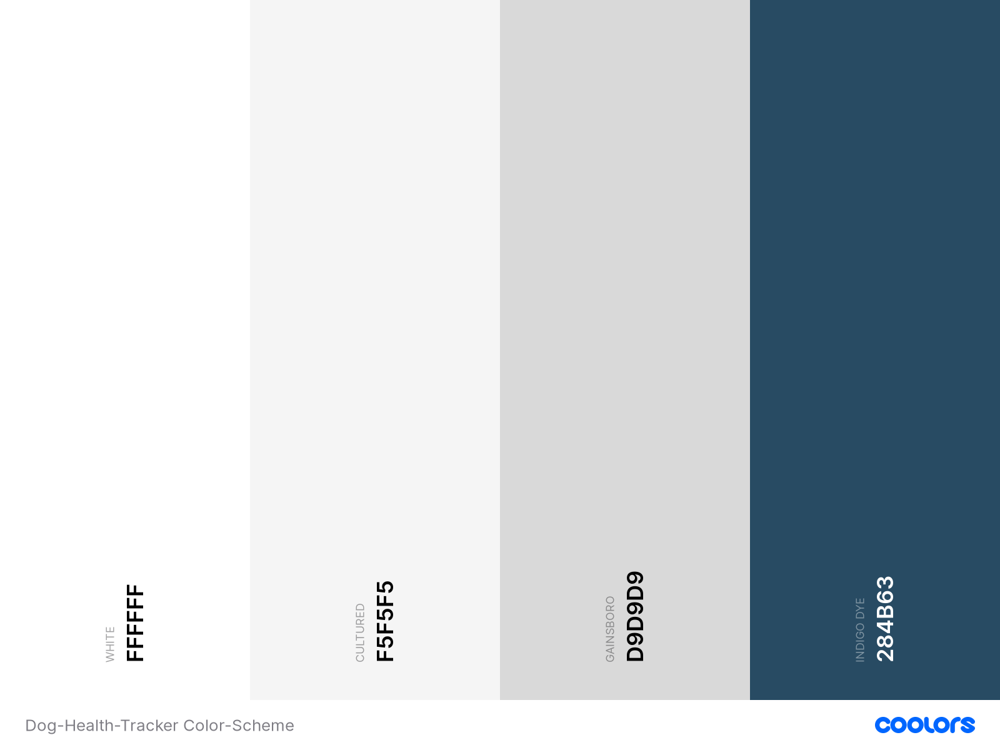

# **Dog Health Tracker**

## **Goal for this project**

Have you ever gone to the veterinarian with your dog and they ask all kind of questions that you don't really know the answer to...
How much activity does your dog have? Have much does he/she eats? Is her weight stable? 
And on top of this, they tell you that your dog should actually lose some weight... Where to start?

The Dog Health Tracker will make you're life much easier! 
Instead writing down all the information about the activity, food, weigth etc. on paper, you can use DHT to track! 
By adding a daily log on the topics previously mentioned, you can easily track the progress of your dog. 

Next time you go to the veterinarian, you choose nicely the progress you and your dog have made! 
And you will finally be able to answer all those questions they are asking! 

Thank you for visiting my project!  
If you have any feedback or questions, head over to my GitHub contact details and feel free to reach out to me.

--- 

## Table of contents 
* [UX](#ux)
    * [User Goals](#user-goals)
    * [User Stories](#user-stories)
    * [Site Owners Goals](#site-owners-goals)
    * [User Requirements and Expectations](#user-requirements-and-expectations)
        * [Requirements](#requirements)
        * [Expectations](#expectations)
    * [Design Choices](#design-choices)
        * [Fonts](#fonts)
        * [Colors](#colors)
        * [Structure](#structure)
* [Wireframes and Flowcharts](#wireframes-and-flowcharts)
    * [Wireframes](#wireframes)
    * [Flowcharts](#flowcharts)
    * [Database Structure](#database-structure)
* [Features](#features)
    * [Existing Features](#existing-features)
    * [Features to be implemented](#features-to-be-implemented)
* [Technologies used](#technologies-used)
    * [Languages](#languages)
    * [Libraries and Frameworks](#libraries-and-frameworks)
    * [Tools](#tools)
* [Testing](#testing)
* [Deployment](#deployment)
* [Credits](#credits)
* [Closing Note](#closing-note)

--- 

## **UX**

### **User Goals**

* The website has to work well on all kind of devices like mobile phones, tables and desktops.
* I want to have a clear dashboard where I can see all the different logs I have created. 
* The log should appear with the most recent one on top to be relevant. 
* I would like to have the option to add my both dog.
* I want to have a profile for my dog where I can enter information like the name, breed etc. 
* The website has to be easy to use and update
* Visually appealing website

[Back to Top](#table-of-contents)

### **User Stories**

* As a user, I would like to be able to register for the website so I can have my personal environment.
* As a user, I want to login after I created an account and see my previous inserted information.
* As a user, I would like to have a personal profile for my dog. 
* As a user, I would like to track activity, food and weigth. 
* As a user, I want to be able to add a log on a daily basis. 
* As a user, I would like to have a dashboard where I can have a good overview. 
* As a user, I want to be able to search on date to get specific data. 
* As a user, I want to be able to add special notes to the log whenever relevant. 
* As a user, I want to be able to add another dog.
* As a user, I want to have the possibility to edit a log when I made a mistake or want to add some info. 
* As a user, I want to have the possibiltiy to delete a log as well when no longer relevant. 
* As a user, I want the website to be easy to use. 
* As a user, I want the process to add a log to be simple to not loose too much time. 

### **Site owners Goals**
* To have an appealing website that dog owners use to track their dog.
* To have a great functionality so the user feels like this website helps them in their day-to-day life. 
* To make the website as personal as possible by giving the user the possibility to add information about their dog in the profile.

[Back to Top](#table-of-contents)

### **User Requirements and Expectations**

#### Requirements

* Easy to navigate by using the few buttons
* Appealing dashboard with a functional overview
* Easy way to add a log to the dashboard
* Easy way to add another dog to the profile
* Ability to edit and delete existing logs

#### Expectations

* When you have multiple dogs, it should be easy to navigate between them
* To have a dashboard where all the necessary information is visible
* It should be easy to add another log 
* Personalised profile with information about the dog and an image
* To be able to filter on the logs in order to get specific information

[Back to Top](#table-of-contents)

### **Design Choices**

I have used [Coolors](https://coolors.co/ "Coolors.co") to come up with a color scheme that matches the atmosphere of a Health Tracker.
For this website I have deciced to keep design simple, meaning I opted for a white background color with some light gray for the profile and logs.
I have added some color for the buttons to make the design more visually appealing to the user. 

#### Fonts
In order to find appropriate fonts for my website, I have visited [Google Fonts](https://fonts.google.com/ "Google Fonts") to explore the various options.
For the titles and subtitles, I have used the font [Play](https://fonts.google.com/specimen/Play "Play") 
and for the main text I have used [Cormorant Garamond](https://fonts.google.com/specimen/Cormorant+Garamond "Cormorant Garamond"). 

#### Colors

Like I mentioned before, I have decided to use some colors that fit well with the feeling of a Health Tracker.
Below I will explain more why I choose the various colors and for what I will be using them.

* #ffffff: I have decided to keep the background of the overall website white in order give the clean look. I will also use this color as text color for the nav bar and buttons.
* #F5F5F5: This color I will use as a background color for the logs on the dashboard in order to have a small contract versus the white background.
* #D9D9D9: This color I will use as a background color for the profile, to stand out a bit more and to make a clear difference between profile and logs.
* #284B63: This will be the color that I will use for my navigation bar and buttons in order to give a bit of color to the website.
* #000000: I will use the standard black color as my text color in order to keep the simple / clean look. 

I have used a contract checker in order to make sure that the contract is sufficient.
This way my content will be easily readable. 

#### Structure

I have chosen to use [Bootstrap](https://getbootstrap.com/) to create an overall structure for my website. 
Bootstrap provides various elements of CSS and Javascript which is very helpful to keep a good structure on your page. 
As Bootstrap is designed for mobile first, I will be certain that my website functions well on mobile.

[Back to Top](#table-of-contents)

--- 

## **Wireframes and Flowcharts**

### **Wireframes**
I used [Balsamic](https://balsamiq.com/wireframes/) to create wireframes for my website. 

You can find my wireframes below:

#### Desktop Wireframes
* [Home](wireframes/desktop-home.png)
* [Dashboard](wireframes/desktop-dashboard.png)
* [Add Dog](wireframes/desktop-adddog.png)
* [Add Log](wireframes/desktop-addlog.png)

#### Tablet Wireframes
* [Dashboard](wireframes/tablet-dashboard.png)
* [Add Dog](wireframes/tablet-adddog.png)
* [Add Log](wireframes/tablet-addlog.png)

#### Mobile Wireframes
* [Dashboard](wireframes/mobile-dashboard.png)
* [Add Dog](wireframes/mobile-adddog.png)
* [Add Log](wireframes/mobile-addlog.png)

### **Flowcharts**

I have decided to make a flowchart for the sign-in / register proces to completely understand each step of the process.  
I have used [Draw.io](https://draw.io/) to make this flowchart which you can view below: 

[Flowchart](wireframes/flowchart.png)

### **Database Structure**

I have used MongoDB to set up the database for this project with the following collections: 

#### **Users:**

Key      | Value
---------|-----------
_id      | ObjectId
username | String
password | String

#### **Dogs:**

Key             | Value
----------------|-----------
_id             | ObjectId
user_id         | String
dog_name        | String
dog_breed       | String
date_of_birth   | String
dog_description | String
dog_image       | String

#### **Logs:**

Key             | Value
----------------|-----------
_id             | ObjectId
dog_id          | String
user_id         | String
log_date        | String
dog_weigth      | String
weigth_metric   | String
dog_activity    | String
dog_food        | String
food_metric     | String
other_notes     | String

#### **Food_metrics** ####

Key             | Value
----------------|-----------
_id             | ObjectId
metric_name     | String

#### **Weigth_metrics** ####

Key             | Value
----------------|-----------
_id             | ObjectId
metric_name     | String

[Back to Top](#table-of-contents)

---

## **Features**

### **Existing Features**

* Registration functionality
* Sign In and Out functionality
* Add multiple dogs per user 
* CRUD Functions:
    * Create: possibility to add various dogs and logs
    * Read: dashboard where you can view the dog profile(which was selected) and its logs
    * Update: possibility to update the dog profile and logs
    * Delete: possibility to delete the dog profiles and logs

### **Features to be implemented**

* Currently the user can only insert image url. In the future I would like that the user can upload an image from its computer.
* Have a more extensive user profile with email where you can send updates, newsletters to. 
* Have a 'forget password' functionality.
* Possibility for the user to be able to add categories they would like to specificely track for their dog like medication etc. 
* The possibility to filter the logs 
* Expand search function so user can filter on more keywords except for log_date
* Add pagination so the list of logs will be display with a max of 20 logs per page

[Back to Top](#table-of-contents)gi

## **Technologies used**

### **Languages**

* [HTML](https://en.wikipedia.org/wiki/HTML)
* [CSS](https://en.wikipedia.org/wiki/Cascading_Style_Sheets)
* [JavaScript](https://en.wikipedia.org/wiki/JavaScript)
* [Python](https://www.python.org/)

### **Libraries and Frameworks**

* [Font Awesome](https://fontawesome.com/)
* [Materialize](https://materializecss.com/)
* [Google Fonts](https://fonts.google.com/)
* [jQuery](https://jquery.com/)

### **Tools**
* [Git](https://git-scm.com/)
* [GitPod](https://www.gitpod.io/)
* [Heroku](https://www.heroku.com/)
* [Balsamic](https://balsamiq.com/wireframes/)
* [W3C HTML Validation Service](https://validator.w3.org/)
* [W3C CSS Validation Service](https://jigsaw.w3.org/css-validator/)
* [techsini](http://techsini.com/)
* [MongoDB Atlas](https://www.mongodb.com/)
* [Flask](https://flask.palletsprojects.com/en/1.1.x/)
* [PyMongo](https://api.mongodb.com/python/current/tutorial.html)
* [Jinja](https://jinja.palletsprojects.com/en/2.11.x/)

[Back to Top](#table-of-contents)

## **Testing**

### **Registration**

#### User story: As a user, I would like to be able to register for the website so I can have my personal environment

* **Plan**  
I want to create a page where the user can register for its personal account to which only the user has access.
After registration, the user will be taken to the "Add dog" form to add their dog right away to their profile. 

* **Implementation**  
I created a form where the user can fill choose a username and a password. 
I have used the pattern attribute to only allow certain characters for the username and password. 
Correct feedback will be displayed whenever the user doesn't meet the pattern critera. 
Before creating the new account, I will check in the database if the username already exists. 
If so, correct feedback will be displayed to the user so he can choose another username. 
Password will be stored with the help of the password generate hash so it is stored safely.
After the registration was succesfull, the user will be redirected to the adddog page to add it's first dog.

* **Test**  
I have tried to create an account with an already existing username. Correct feedback is displayed.
Whenever I didn't meet the pattern criteria, the correct feedback was displayed, explaining which charachters etc are allowed. 
User acccount is created whenever all criteria was met and user is being redirect to adddog page to add its first dog. 

* **Result**  
Registration form is working as planned and user information is stored safely in the mongodb Users collection.
Redirection to add dog works as well as planned so the user can add its dog right away. 
Tested the registration on various browers and devices and the form is responsive and userfriendly. 

* **Verdict**
The test has passed all the criteria and works like planned.

### **Sign In**

#### User story: As a user, I want to login after I created an account and see my previous inserted information.

* **Plan**  
My plan is to create a login form where the user can fill in its username and password.
After signing in, the user will be redirected to the dashboard where the user can see the previously inserted information.

* **Implementation**  
I created a form where the user can fill in its username and password which will be verified with the information stored in the database. 
When the wrong information is being filled in, the correct feedback will be provided to the user. 
In case the user wrongfully clicked on sign in instead of register, a link to the register page is provided so the user doesn't have to go back. 

* **Test**  
Signing in with the correct username and password works as planned and the dashboard of that user will be displayed. 
When the user fills in the wrong username and/or password, the correct message is being displayed on the screen. 
Redirecting to register page works as well. 

* **Result**  
Sign in form is working as planned and the input is being verified correctly with the stored information of the database.
Redirection to the dashboard works as well as planned so the user can view its previously inserted information.
Tested the sign in form on various browers and devices and the form is responsive and userfriendly. 

* **Verdict**    
The test has passed all the criteria and works like planned.

### **Profile Dog**

#### User story: As a user, I would like to have a personal profile for my dog. 

* **Plan**  
The user should be able to created a profile for the dog in which it can fill in various information. 
Possible input fields should be the name of the dog, breed, date of birth, description and an image of the dog. 
A summary of the dog profile will be displayed on the dashboard overview. 

* **Implementation**  
Created a form with the various input fields where the user can fill in the information. 
I didn't make any of the fields required as for some dogs, the date of birth etc is unknown and the user might not want to fill this in. 
For the image, I worked with an url that has to be filled in. I don't have the required knowledge and skills yet to enable the user to upload an image from its device. 
This will be implemented at a later stage when I have the required knowledge and skills. 
For the date of birth, I have implemented the datepicker from materialize so the user can select the date on the calendar. 
The range for years, goes until 30 years back (Research told me that the oldest dog in the world was 29 years old). 
The user can not pick a date in the future as that information is unknown. 
Manual input has been disabled so the user has to pick the date from the calendar and a correct date will be stored in the correct format. 
I have also added a cancel button that allows the user to go back to the dashboard in case the user doesn't want to proceed. 
I have disabled the cancel button on the add dog form that is being displayed after registring as the user should have at least one dog added to its account.

* **Test**  
I have tested the add dog form various times to make sure it works properly.
The input is stored correctly in the dogs collection in the database. 
Calendar works as planned with the correct year range being displayed and when clicking a day on the calendar, the calendar automatically closes. 
Cancel button works as planned and takes the user back to the dashboard. Cancel button is hidden whenever the count of dogs from the user equals to 0. 
In order to display the correct dogs for the user, I have addded the _id the user as a hidden inputfield for the add dog which is stored in the database.

* **Result**  
Adding a profile for the dog works as planned and looks good across various browsers and devices. 
This includes the inputfields, the datepicker (with the correct range of years), cancel button. 
Upon submitting the form, the input is stored correctly in the database. 

* **Verdict**  
The test has passed all the criteria and works like planned.

### **Add log**

#### User story: As a user, I would like to track activity, food and weigth. 

* **Plan**  
The user should be able to add logs with the various information that needs to be tracked. 
From own experience, I have decided to include the following input fields:
* Date of the log 
* Activity 
* Weigth 
* Food 
* Other notes 

* **Implementation**  
Also here I have created a form with the various inputfields. 
For date I have again used the datepicker with future dates disabled as you shouldn't be able to log for future data. 
For the activity I have not added any metrics etc because it can vary a lot depending on the user and the dog (example: playing with a stick can also be seen as activity for some users)
For the weigth I have inlucded metrics (kg, grams, pounds and ounces) which are the most important weight metrics being used. 
For the food I have included the same metrics. 
For other notes the user can choose what to fill in like comments on the behaviour of the dog, medication, vet's appointment etc. 
Also here I added a cancel button in case the user wants to go back to the dashboard without submitting the log. 

* **Test**  
I have tested the form on various browsers and devices and it works as planned. 
The correct input is stores in the logs collection in the database. 
In order to be able to display the relevant logs of the dog, I have added 2 hidden fields on the form: user_id and dog_id. 
This information is also being stored in the database and through this, I'm able to display the logs of a specific dog from the user. 
Cancel button brings the user back to the dashboard as planned. 

* **Result**  
Add log form for tracking purpose works as planned for various browsers and devices. 
Correct information is stored and relevant logs can be retrieved to display on dashboard. 

* **Verdict**  
The test has passed all the criteria and works like planned.

### ****

#### User story: 

* **Plan**  

* **Implementation**  

* **Test**  

* **Result**  

* **Verdict**  

### ****

#### User story: 

* **Plan**  

* **Implementation**  

* **Test**  

* **Result**  

* **Verdict**  

### ****

#### User story: 

* **Plan**  

* **Implementation**  

* **Test**  

* **Result**  

* **Verdict**  